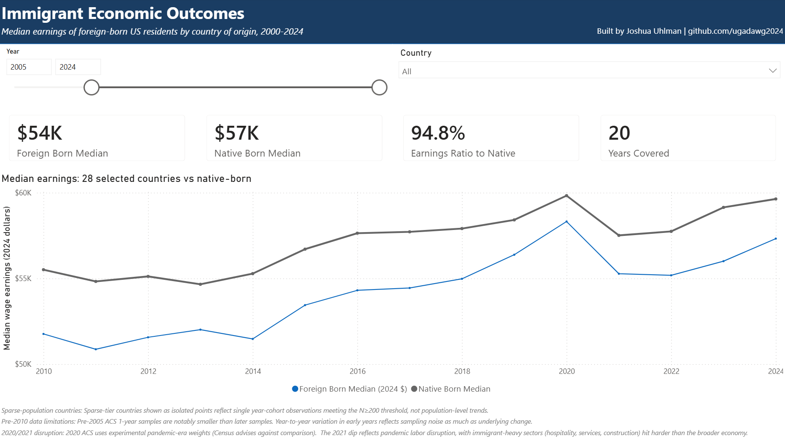
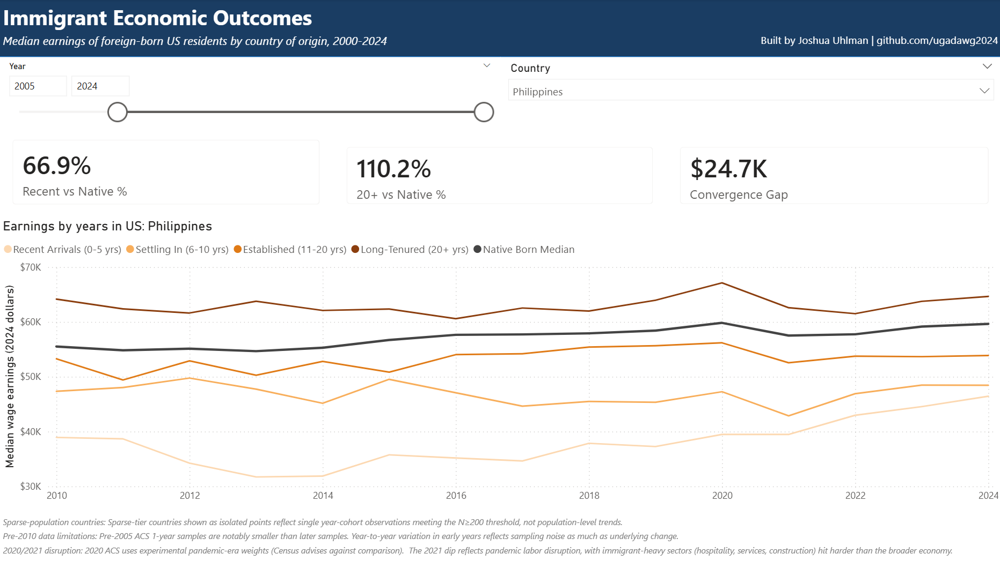
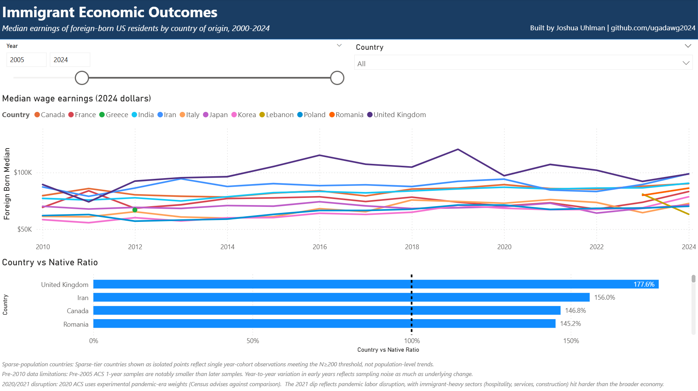

# Immigrant Economic Outcomes — ACS Data Visualization

A Power BI dashboard analyzing economic outcomes of foreign-born populations
in the United States, using harmonized ACS microdata from
[IPUMS USA](https://usa.ipums.org). Built as a non-commercial portfolio
data analysis project.

## What it shows

The dashboard answers three questions across three pages:

1. **Overview** — How do foreign-born US residents compare to native-born,
   in aggregate and by country?
2. **Trajectory** — How do immigrant earnings change with years since
   arrival? Do they converge to native-born medians, and how varies by
   country of origin?
3. **Comparison** — Which immigrant origin groups earn most, and which
   earn least, relative to native-born comparators?

## Dashboard preview

> _Add screenshot embeds here once captured._
>
> 
> 
> 
> 

## About the data

| | |
|---|---|
| **Source** | IPUMS USA — <https://usa.ipums.org> |
| **Underlying surveys** | ACS 1-year samples, 2000–2024 |
| **Default time range** | 2005–2024 (pre-2005 ACS samples were materially smaller) |
| **Working-age window** | Ages 25–64 |
| **Sample restriction** | Employed (`EMPSTAT=1`) with positive wage income |
| **Primary measure** | Median wage and salary income (`INCWAGE`), inflation-adjusted to 2024 dollars via CPI-U |
| **Comparator** | Native-born population of the same age cohort |
| **Sample-size threshold** | N ≥ 200 unweighted observations per cell |

### IPUMS citation

> Steven Ruggles, Sarah Flood, Matthew Sobek, Daniel Backman, Grace Cooper,
> Julia A. Rivera Drew, Stephanie Richards, Renae Rodgers, Jonathan
> Schroeder, and Kari C.W. Williams. *IPUMS USA: Version 16.0* [dataset].
> Minneapolis, MN: IPUMS, 2025. <https://doi.org/10.18128/D010.V16.0>

The underlying data is provided by the [United States Census Bureau](https://www.census.gov)
through the American Community Survey (ACS); IPUMS USA harmonizes these
data into the analysis-ready microdata used by this dashboard.

### License compliance

This project complies with the
[IPUMS USA Usage License](https://usa.ipums.org/usa/terms.shtml). Raw
microdata is not committed to this repository. All published outputs are
aggregated summaries (medians and counts) computed using IPUMS person
weights and meeting an N ≥ 200 sample-size threshold.

This dashboard is registered with the IPUMS Bibliography at
<https://bibliography.ipums.org>.

## Tech stack

- **IPUMS USA** for raw microdata extracts
- **Python** (standard library only) for survey-weighted pre-aggregation
- **Power BI Desktop** with Power Query (M) and DAX for the dashboard

## Methodology

The data has nontrivial methodological choices around sample-size thresholds,
the native-born comparator definition, years-since-arrival cohorting, and the
treatment of ACS 2020 experimental weights. Read
[docs/methodology.md](docs/methodology.md) before interpreting the visuals.

## Project structure
.
```
├── pbix/ Power BI report (.pbix) — see notes on local-only files
├── m-code/ Power Query M scripts (one per query)
├── dax/ DAX measures, exported one per line
├── scripts/ Python helper (IPUMS aggregation)
├── data/ Local data; raw IPUMS data not committed (license)
├── docs/ Methodology, data model, findings, known issues
├── ipums/ IPUMS extract specification for reproducibility
├── screenshots/ Dashboard screenshots
├── LICENSE CC0 1.0 Universal (code only — IPUMS data separately licensed)
└── README.md
```

## How to reproduce

See [docs/setup.md](docs/setup.md). Summary:

1. Register at <https://usa.ipums.org>
2. Pull the extract per [ipums/extract-spec.md](ipums/extract-spec.md)
3. Run `python scripts/ipums_aggregator.py` to produce the aggregated CSV
4. Open `pbix/immigrant-outcomes.pbix` in Power BI Desktop
5. Refresh

## Findings

See [docs/findings.md](docs/findings.md).

## Known data issues

See [docs/known-issues.md](docs/known-issues.md).

## License

Code and configuration: [CC0 1.0 Universal](LICENSE). The underlying IPUMS
data is separately licensed under the
[IPUMS USA Usage License](https://usa.ipums.org/usa/terms.shtml) and is
not redistributed in this repository.

## About

Portfolio project by Joshua Uhlman ([github.com/ugadawg2014](https://github.com/ugadawg2014)).
